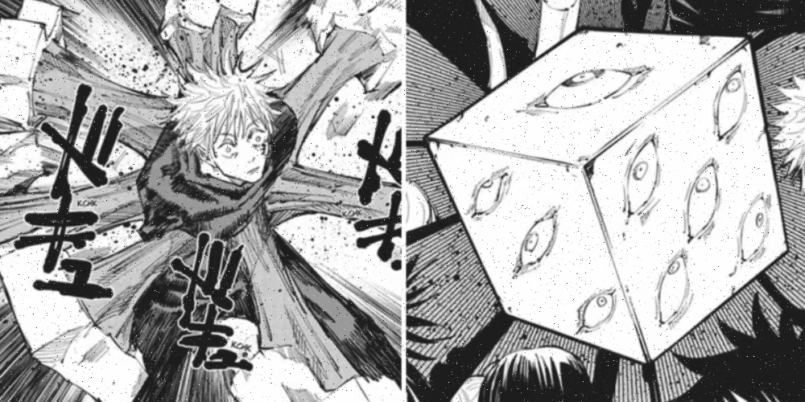
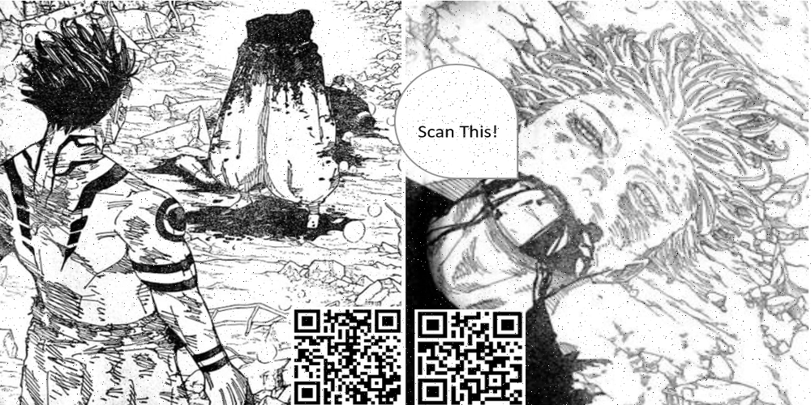

# Image-Processing-and-Transmission-with-Error-Correction-using-Hamming-Codes


## 🌀 Unveiling the Hidden Plan: Overcoming Geto's Curse

> **Anime-Themed Transmission & Error-Correction Project** using Hamming Code and XOR 🔒⚡
> Help Mechamaru, Yuji, and Megumi rescue Gojo by decoding the cursed image sealed by Geto!

---

## 🧿 Mission Overview

Gojo has been sealed inside the *Prison Realm* by Geto, Mahito, and Jogo under a Gigantic Veil (Tobari) 🌀.
Only Mechamaru’s encoded message reveals their plan — but the curse corrupts the message mid-transmission!

Your job:

1. Encode the image using **Hamming(12,8)** to allow error correction. <br>
2. Simulate **random transmission errors** (bit flips).<br>
3. Decode and **correct errors**.<br>
4. Defeat Geto’s curse by **XORing** with a corrupted binary file.<br>
5. Reveal the hidden message/image from Gojo! 😤🧊<br>

---

## ⚙️ Features

✅ Image encoding using **Hamming Code** (12,8)<br>
✅ Custom **error simulator** (`Channel.py`) that randomly flips bits<br>
✅ Powerful **decoder** with single-bit error correction<br>
✅ Final decryption using **bitwise XOR**<br>
✅ Image reconstruction with `Pillow` 🖼️<br>
✅ Fun anime story-based theme!<br>

---

## 📂 Folder Structure

```
your_project/
├── main.py                   # Main logic (Encode -> Simulate -> Decode -> XOR)
├── Input_image.png           # Gojo’s original image (source)
├── Channel.py                # Simulates Geto’s cursed veil (bit flipping)
├── Array_to_be_Xored.bin     # Geto's curse data for final XOR
├── encoded.bin               # Hamming-encoded image (generated)
├── received.bin              # Corrupted data (generated)
├── recovered.png             # Decoded image before XOR
├── revealed.png              # FINAL: Hidden plan revealed!
|── README.md                 # ALL ABOUT THE PROJECT
|-- Flow chart of code.png    # FLOW CHART FOR BETTER UNDERSTANDING 
```

---

## 🚀 How to Run

### Step 1: Install Dependencies

```bash
pip install pillow numpy bitarray
```

### Step 2: Run the Program

```bash
python3 main.py
```

🎉 That’s it! The final decoded message will be saved as:

* 🔍 `recovered.png` → Decoded version of the original image (before XOR)<br>
* 🌀 `revealed.png` → XORed result with Geto’s curse (the hidden message!!)

---

## 🛠️ Technologies Used

| Tool / Library | Purpose                       |
| -------------- | ----------------------------- |
| `Pillow`       | Image conversion & saving     |
| `NumPy`        | Numerical operations, bit ops |
| `bitarray`     | Efficient bit-level handling  |
| `subprocess`   | Run the `Channel.py` script   |

---

## 🔐 Behind the Scenes: How It Works

| Step                   | Description                                              |
| ---------------------- | -------------------------------------------------------- |
| 1️⃣ Preprocess         | Convert original image to grayscale + resize to 500x1000 |
| 2️⃣ Hamming Encode     | Use Hamming(12,8) to generate parity-protected data      |
| 3️⃣ Channel Corruption | Simulate bit flips using `Channel.py`                    |
| 4️⃣ Hamming Decode     | Detect and correct single-bit errors                     |
| 5️⃣ XOR with Curse     | XOR decoded bits with Geto’s cursed binary               |
| 6️⃣ Reveal Image       | Save final secret image from Gojo as `revealed.png`      |

---

## 🧙‍♂️ Credits & Lore

This project is inspired by the world of **Jujutsu Kaisen** 🌌
Your role: 🧑‍💻 Help Mechamaru communicate the truth while Yuji and Megumi decode the signal under the cursed veil.

> “Even if I die... I want Gojo to be set free. That’s all that matters.”
> — *Mechamaru, in his final transmission*

---

## 🎓 Educational Value

✅ Learn **error correction coding (Hamming)**<br>
✅ Understand **bit-level image processing**<br>
✅ Practice **Python file I/O & encoding**<br>
✅ Integrate **fun storytelling into tech projects**<br>

---

## 💡 Future Upgrades

* [ ] Add Hamming(15,11) support<br>
* [ ] Support for color images (RGB channels)<br>
* [ ] GUI to visualize transmission corruption<br>
* [ ] Web app version using Flask<br>

---

## 📸 Result Previews

<table>
<tr>
<td align="center"><strong>Original Image (Input)</strong></td>
<td align="center"><strong>Decoded (Recovered)</strong></td>
<td align="center"><strong>Final Revealed (XORed)</strong></td>
</tr>
<tr>
<td></td>
<td></td>
<td></td>
</tr>
</table>

---
## 🔗 Related Project

If you're interested in a more fundamental implementation of Hamming code encoding, decoding, and error simulation, you can check out my earlier project here:

**👉 [Error Correction using Hamming Code](https://github.com/SAI-SRIVARDHAN-REDDY-LINGALA/Error-correction-using-Hamming-code-)**

This repository explores the core logic of Hamming(12,8) encoding and decoding in a more focused environment without image processing. It serves as a great foundation for understanding the error correction techniques used in this image transmission project.


----


## 🙌 Special Thanks

* **Pillow**, **NumPy**, and **bitarray** devs<br>
* Inspired by **Jujutsu Kaisen**, for turning code into a battlefield<br>
* Shoutout to coders who turn *bugs into cursed spirits* 🐛💀<br>

---

## ⭐️ Star this repo if you enjoyed decoding Gojo's plan!

Made with 💙 by **[Sai Srivardhan Lingala](mailto:saisrivardhanlingala@gmail.com)**
*“Coding is cursed energy — protect, defend, reveal.”*


